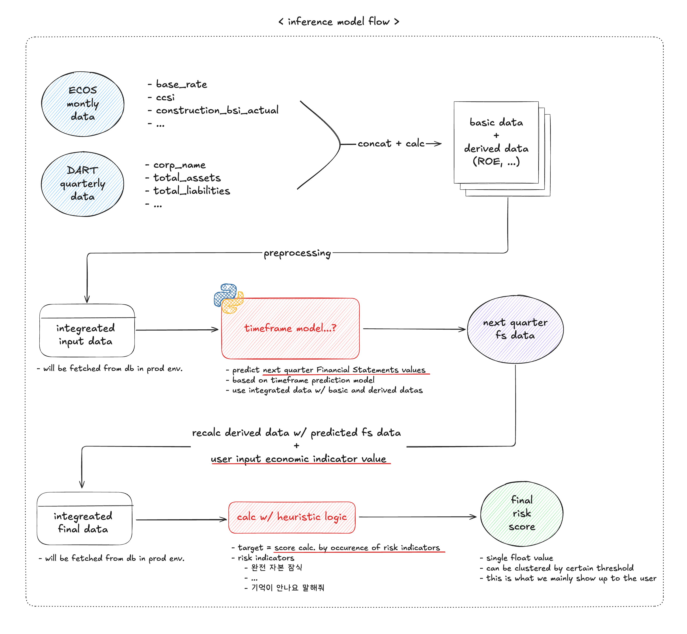

# 한국 건설업 리스크 평가 프로젝트

한국 건설업체의 재무 위험도를 예측하는 머신러닝 기반 종합 분석 시스템

## 프로젝트 개요

본 프로젝트는 DART 재무데이터와 ECOS 경제지표를 활용하여 한국 건설업체의 재무 위험도를 예측하는 시스템입니다. 머신러닝 모델과 휴리스틱 모델을 통해 다각적인 리스크 분석을 제공합니다.

### 주요 기능
- **데이터 수집**: DART API와 ECOS API를 통한 자동 데이터 수집
- **전처리**: 경제지표와 재무데이터의 통합 전처리 파이프라인
- **모델링**: LSTM 기반 경제지표 예측 및 휴리스틱 리스크 평가
- **API 서버**: FastAPI 기반 실시간 예측 서비스

## Docker 환경 설정

### 1. 저장소 복제
```bash
git clone https://github.com/your-repo/kor-ie-proj.git
cd kor-ie-proj
```

### 2. Docker 컨테이너 실행
```bash
# Docker와 docker-compose가 설치되어 있는지 확인
docker-compose up -d

# 컨테이너 중지
docker-compose down

# 컨테이너, 네트워크, 볼륨 모두 제거
docker-compose down -v
```

> 현재는 MySQL 데이터베이스 컨테이너만 구성되어 있습니다.

## 시스템 아키텍처


**구성 요소:**
- **데이터베이스**: MySQL (DART, ECOS 데이터 저장)
- **FastAPI 추론 서버**: 실시간 예측 API 서비스
- **기타 구성요소**: 추후 추가 예정

## 모델 추론 흐름



## 프로젝트 구조

```
kor-ie-proj/
├── dart/                    # DART 재무데이터 수집
│   ├── dart_data.ipynb      # 재무데이터 수집 노트북
│   └── dart_out/            # 수집된 데이터 파일
├── ecos/                    # ECOS 경제지표 수집
│   ├── ECOS_data.py         # 경제지표 수집 스크립트
│   └── economic_data/       # 경제지표 데이터
├── DB/                      # 데이터베이스 설정
│   ├── ddl.sql              # 데이터베이스 스키마
│   └── db_query.py          # DB 연결 및 조회
├── preprocessing/           # 데이터 전처리
│   ├── preprocessing.ipynb  # 통합 전처리 파이프라인
│   └── integrated_data.csv  # 통합 데이터셋
├── modeling/                # 머신러닝 모델링
│   └── LSTM_predict.ipynb   # LSTM 경제예측 모델
├── Heuristic/               # 휴리스틱 리스크 모델
│   ├── Heuristic_model.ipynb # 기본 휴리스틱 모델
│   └── Heuristc_test.ipynb  # 고도화된 휴리스틱 모델
├── preprocessing_ecos_FastAPI/ # FastAPI 전처리 서비스
│   ├── preprocessing.py     # 전처리 API 서버
│   └── test_api.py          # API 테스트
├── docker-compose.yaml      # Docker 설정
└── requirements.txt         # Python 의존성
```

## 기술 스택

### 데이터 수집
- **DART API**: 한국 기업들의 재무제표 데이터
- **ECOS API**: 한국은행 경제통계 데이터
- **MySQL**: 수집된 데이터 저장소

### 데이터 처리
- **Pandas**: 데이터 조작 및 분석
- **NumPy**: 수치 연산 및 배열 처리
- **Scikit-learn**: 데이터 전처리 및 모델 평가

### 머신러닝
- **TensorFlow/Keras**: LSTM 신경망 모델
- **Optuna**: 하이퍼파라미터 최적화

### API 서비스
- **FastAPI**: 고성능 비동기 API 프레임워크
- **Uvicorn**: ASGI 웹 서버

### 기타
- **Docker**: 컨테이너화 및 배포
- **Jupyter**: 대화형 데이터 분석 환경

## 빠른 시작

### 1. 전체 설정
```bash
# 저장소 복제
git clone https://github.com/your-repo/kor-ie-proj.git
cd kor-ie-proj

# Docker로 MySQL 실행
docker-compose up -d

# Python 의존성 설치
pip install -r requirements.txt
```

### 2. 데이터 수집
```bash
# ECOS 데이터 수집
cd ecos
python ECOS_data.py

# DART 데이터 수집 (노트북 실행)
cd ../dart
jupyter notebook dart_data.ipynb
```

### 3. 데이터 전처리
```bash
cd ../preprocessing
jupyter notebook preprocessing.ipynb
```

### 4. 모델 학습 및 예측
```bash
# LSTM 모델
cd ../modeling
jupyter notebook LSTM_predict.ipynb

# 휴리스틱 모델
cd ../Heuristic
jupyter notebook Heuristic_model.ipynb
```

### 5. API 서비스 실행
```bash
cd ../preprocessing_ecos_FastAPI
uvicorn preprocessing:app --reload --host 0.0.0.0 --port 8000
```

## 데이터 세트

### DART 재무데이터
- **대상 기업**: 한국 건설업체 32개사
- **수집 기간**: 2015년 4분기 ~ 2025년 2분기
- **주요 지표**: 자산총계, 부채총계, 자본총계, 매출액, 영업이익, 순이익

### ECOS 경제지표
- **수집 기간**: 2010년 1월 ~ 현재
- **주요 지표**: 기준금리, 물가지수, 환율, 건설업BSI, 주택가격지수 등 19개 지표

## 모델 성능

### LSTM 경제예측 모델
- **예측 대상**: 경기선행지수, 기준금리, 신용스프레드 등 6개 지표
- **예측 기간**: 6개월
- **모델 구조**: 다층 LSTM + Dense 레이어

### 휴리스틱 리스크 모델
- **리스크 등급**: 4단계 (매우높음, 높음, 보통, 낮음)
- **가중치 최적화**: Optuna 활용 13개 파라미터 자동 측정
- **주요 지표**: 재무비율 7개 + 경제지표 6개

## 활용 예시

### 금융기관
- **대출 심사**: 건설업체 리스크 평가
- **포트폴리오 관리**: 업종별 리스크 모니터링

### 공공기관
- **정책 수립**: 건설업 지원 정책 수립 근거
- **경제 동향 분석**: 공공투자 계획 수립

### 민간기업
- **투자 의사결정**: 건설업 투자 시점 분석
- **리스크 관리**: 사업 파트너십 평가

## 환경 요구사항

### 시스템 요구사항
- **운영체제**: Windows 10/11, macOS, Linux
- **Python**: 3.8 이상
- **메모리**: 최소 8GB RAM 권장
- **저장공간**: 최소 2GB 여유 공간

### 필수 소프트웨어
- **Docker**: 컨테이너 환경 (MySQL)
- **Git**: 버전 관리
- **Jupyter**: 노트북 실행 환경

### API 키 요구사항
- **DART API 키**: [DART 사이트](https://opendart.fss.or.kr/)에서 발급
- **ECOS API 키**: [ECOS 사이트](https://ecos.bok.or.kr/)에서 발급

## 문제 해결

### 일반적인 오류

1. **MySQL 연결 오류**
   ```bash
   # Docker 컨테이너 상태 확인
   docker ps
   
   # MySQL 재시작
   docker-compose restart
   ```

2. **API 키 오류**
   ```bash
   # .env 파일 확인
   cat .env
   
   # API 키 재설정 후 재시도
   ```

3. **패키지 의존성 오류**
   ```bash
   # 가상환경 생성 및 활성화
   python -m venv venv
   source venv/bin/activate  # Windows: venv\Scripts\activate
   
   # 의존성 재설치
   pip install -r requirements.txt
   ```

### 성능 최적화

- **GPU 사용**: TensorFlow GPU 버전 설치로 LSTM 학습 속도 향상
- **메모리 관리**: 대용량 데이터 처리 시 청크 단위로 처리
- **API 호출**: 수집 시 적절한 지연시간 설정으로 API 제한 회피

