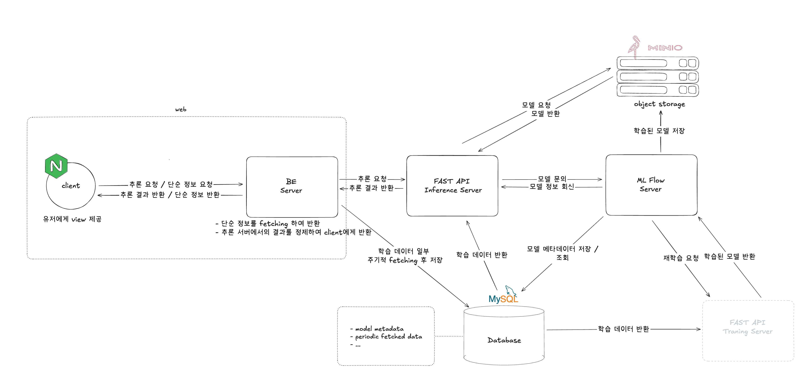

# kor-ie-proj

## docker compose setup

1. Clone the repository
2. Install dependencies
3. compose up the docker containers

> currently only for mysql db.

```bash
// make sure you have docker and docker-compose installed
docker-compose up -d

// to stop the containers
docker-compose down

// to stop and remove all containers, networks, and volumes
docker-compose down -v

```

## architecture



**containers:**

- database: mysql
- fast api inference server: inference-fast-api
- so on... (to be added, currently only for mysql db)
